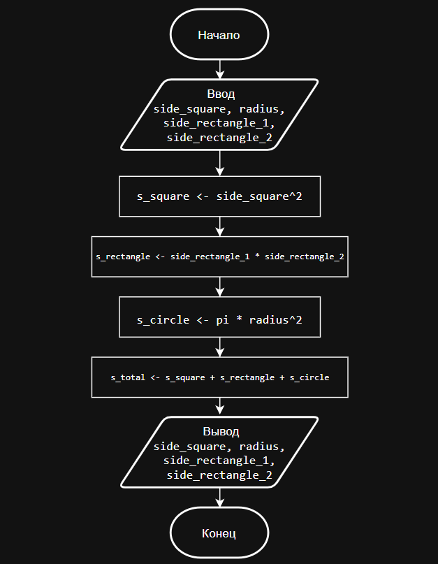
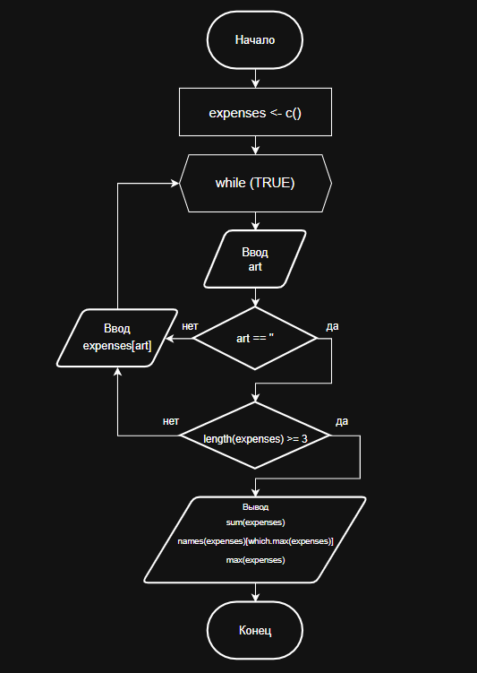
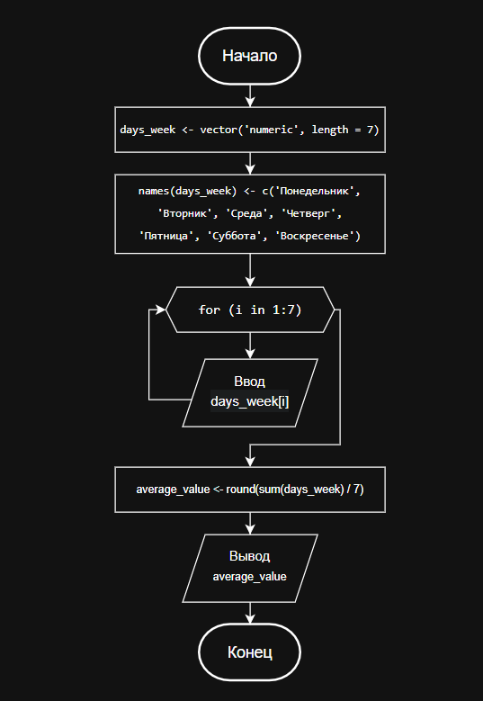

# **Отчет по лабораторной работе 1**
**Тема:** Императивное (процедурное) программирование

## Сведения о студенте
**Дата:** 2025-10-03  
**Семестр:** 2 курс 1 полугодие - 3 семестр  
**Группа:** ПИН-б-о-24-1 (2)  
**Дисциплина:** Технологии программирования  
**Студент:** Макаров Роман Дмитриевич  

---

## **Цель работы**
Познакомиться с особенностями процедурного программирования. Решить задания в процедурном стиле. Составить отчет.   

---

## **Теоретическая часть**
В ходе материала лабораторной работы будут изучены следующие концепции:  

Процедурный стиль программирования — последовательное выполнение команд и организация кода в процедуры.  
Переменные и их виды — создание и использование различных типов данных.  
Функции и их роль — подпрограммы с параметрами и результатами.  
Структура программ — способы написания и организации кода, включая переходы и блоки.  
Структурное программирование — применение управляющих конструкций и методов для повышения читаемости и Модульности кода.  

---

## **Выполненные задания**

### **Задание 1**
Написать программу, выполненную в процедурном стиле. Программа должна быть выполнена в виде псевдокода, в виде блок-схемы и на языке высокого уровня (ЯВУ) (здесь и далее, если не оговорено иное, при отсылке к ЯВУ необходимо выполнять код на языке R). Для построения блок схемы рекомендуется использовать ресурс *draw.io* или аналогичную программу. Построение блок схемы делается с учетом правил, содержащихся в презентации Императивное (процедурное) программирование.  

### Вариант 1  
Напишите программу, рассчитывающую площадь трех фигур: квадрат, прямоугольник и круг. На входе программа запрашивает введение данных о фигурах (для квадрата – сторона, круг – радиус, прямоугольник – две стороны). На выходе программа указывает площади трех фигур и общую площадь.   

### Вариант 2  
Напишите программу, рассчитывающую сумму расходов за месяц. На входе программа запрашивает сведения о расходах по нескольким пунктам (минимум 3 статьи расходов). На выходе программа указывает суммарные расходы и максимальную статью расходов.  

### Вариант 3  
Напишите программу, подсчитывающую среднее количество занятий в неделю. Программа запрашивает информацию о количестве занятий в день (по дням недели). На выходе программа указывает среднее количество занятий в неделю с округлением до ближайшего целого числа.  

---

### **Задание 2**
Опишите, представленный код в виде псевдокода и ответьте на вопрос, что будет получено при передаче функции числа 7? Также реализуйте данный алгоритм на ЯВУ.  

Функция на ассемблере с синтаксисом *AT&T*:
```asm
foo: 
  cmp $0, %edi 
  jg calc 
  mov $1, %eax 
  jmp exit 
calc: 
  push %edi 
  sub $1, %edi 
  call foo 
  pop %edi 
  imul %edi, %eax 
exit: 
  ret 
```
Это функция с одним входным параметром, для которой ABI (двоичный интерфейс приложений) предписывает передачу одного параметра через регистр `%edi`, а передачу возвращаемого значения через регистр `%eax`.  

*Замечания:*
1) Команда `imul src, dest` умножает `src` на `dest` и кладет результат в `dest`. 
2) Не нужно думать о переполнении. Его здесь не будет.

---

## **Ход работы**

### **Задание 1. Вариант 1**

**Псевдокод:**
```md
Начало программы

Запросить у пользователя ввод длины стороны квадрата и сохранить в переменную side_square
Преобразовать введённое значение в число

Запросить у пользователя ввод первой стороны прямоугольника и сохранить в переменную side_rectangle_1
Преобразовать введённое значение в число

Запросить у пользователя ввод второй стороны прямоугольника и сохранить в переменную side_rectangle_2
Преобразовать введённое значение в число

Запросить у пользователя ввод радиуса круга и сохранить в переменную radius
Преобразовать введённое значение в число

Вычислить площадь квадрата: s_square = side_square * side_square
Вычислить площадь прямоугольника: s_rectangle = side_rectangle_1 * side_rectangle_2
Вычислить площадь круга: s_circle = pi * radius * radius
Вычислить общую площадь: s_total = s_square + s_rectangle + s_circle

Вывести результаты:
    Площадь квадрата: s_square
    Площадь прямоугольника: s_rectangle
    Площадь круга: s_circle
    Общая площадь: s_total

Конец программы
```

**Блок-схема:**



**Программный код:**
```R
side_square <- as.numeric(readline(prompt = 'Введите сторону квадрата: '))
side_rectangle_1 <- as.numeric(readline(prompt = 'Введите 1 сторону прямоугольника: '))
side_rectangle_2 <- as.numeric(readline(prompt = 'Введите 2 сторону прямоугольника: '))
radius <- as.numeric(readline(prompt = 'Введите радиус круга: '))

s_square <- side_square^2
s_rectangle <- side_rectangle_1 * side_rectangle_2
s_circle <- pi * radius^2

s_total <- s_square + s_rectangle + s_circle

cat('\n', 'Площадь квадрата: ', s_square, '\n', 'Площадь прямоугольника: ', s_rectangle, '\n', 'Площадь круга: ', s_circle, '\n', 'Общая площадь: ', s_total, '\n')
```

**Пример работы программы:**  
```bash
Введите сторону квадрата: 4
Введите 1 сторону прямоугольника: 7
Введите 2 сторону прямоугольника: 1
Введите радиус круга: 1

 Площадь квадрата:  16
 Площадь прямоугольника:  7
 Площадь круга:  3.141593
 Общая площадь:  26.14159
```

---

### **Задание 1. Вариант 2**

**Псевдокод:**
```md
Создать пустой вектор expenses

Бесконечный цикл:
    Ввести статью расходов (art)
    Если статья расходов пустая:
        Если количество статей в expenses >= 3:
            Вывести "Суммарные расходы: " + сумма(expenses)
            Вывести "Максимальная статья расходов: " + имя_максимального(expenses) + значение_максимального(expenses)
            Завершить программу
        Иначе:
            Вывести "Необходимо ввести минимум 3 статьи расходов!"
    Иначе:
        Ввести сумму расходов для статьи art
        Добавить в expenses статью art с введенной суммой
```

**Блок-схема:**



**Программный код:**
```R
expenses <- c()
while (TRUE) {
    art <- (readline(prompt = 'Введите статью расходов: '))
    if (art == '') {
        if (length(expenses) >= 3) {
            cat('\n', 'Суммарные расходы: ', sum(expenses), '\n', 'Максимальная статья расходов: ', names(expenses)[which.max(expenses)], max(expenses), '\n')
            break
        } else {
           cat('Необходимо ввести минимум 3 статьи расходов!', '\n')
        }
    } else {
       expenses[art] <- as.numeric(readline(prompt = 'Введите число расходов: '))
    }
}
```

**Пример работы программы:**  
```bash
Введите статью расходов: Статья-1
Введите число расходов: 12500
Введите статью расходов: Статья-2
Введите число расходов: 7000
Введите статью расходов: Статья-3
Введите число расходов: 32500
Введите статью расходов: 

 Суммарные расходы:  52000
 Максимальная статья расходов:  Статья-3 32500
```

---

### **Задание 1. Вариант 3**

**Псевдокод:**
```md
Начало программы

    Создать числовой именованный вектор с длиной 7 days_week
    имена(days_week) = ['Понедельник', 'Вторник', 'Среда', 'Четверг', 'Пятница', 'Суббота', 'Воскресенье']

    Вывести "Количество занятий в день недели."
    Для i от 1 до 7:
        prompt_текст = объединить(имена(days_week)[i], ': ')
        days_week[i] = число(ввод_пользователя(prompt = prompt_текст))

    average_value = округлить(сумма(days_week) / 7)
    Вывести "Среднее количество занятий в неделю:" average_value

Конец программы
```

**Блок-схема:**



**Программный код:**
```R
days_week <- vector('numeric', length = 7)
names(days_week) <- c('Понедельник', 'Вторник', 'Среда', 'Четверг', 'Пятница', 'Суббота', 'Воскресенье')

cat('\tКоличество занятий в день недели.\n')
for (i in 1:7) {
    days_week[i] <- as.numeric(readline(prompt = paste(names(days_week)[i], ': ', sep = '')))
}

average_value <- round(sum(days_week) / 7)
cat('\n', 'Среднее количество занятий в неделю:', average_value, '\n')
```

**Пример работы программы:**  
```bash
        Количество занятий в день недели.
Понедельник: 1
Вторник: 2
Среда: 3
Четверг: 4
Пятница: 5
Суббота: 6
Воскресенье: 7

 Среднее количество занятий в неделю: 4
```

---

## Задание 2

**Псевдокод:**
```md
Функция foo(n):
    Если n > 0:
        сохранить n
        результат = foo(n - 1)
        восстановить n
        результат = n * результат
        вернуть результат
    Иначе:
        вернуть 1
```

**Программный код:**
```R
foo <- function(n) {
  if (n > 0) {
    return(n * foo(n - 1))
  } else {
    return(1)
  }
}

# передаем функции значение 7 для проверки
result <- foo(7)
print(result)
```

**Результат работы программы (при foo(7)):**  

```md
[1] 5040
```

---

## **Результаты**

### **Выводы**
1. В ходе выполнения лабораторной работы были освоены основные принципы процедурного программирования через практическое решение задач. Сформировалось важное понимание того, что независимо от языка программирования, будь то ассемблер или R, логика алгоритмов остается единой. 

2. Сравнение рекурсивной функции на ассемблере и её реализации на R - наглядно продемонстрировало, как одни и те же вычислительные концепции воплощаются на разных уровнях абстракции.

3. Работа с псевдокодом позволила развить навыки алгоритмического мышления, отделяя суть решения задачи от особенностей конкретного языка. Полученный опыт подтвердил, что процедурный подход создает прочный фундамент для понимания того, как компьютеры выполняют программы на самом базовом уровне.

4. В результате лабораторной работы были получены не просто знания о синтаксисе R, а системное понимание того, как мыслить в терминах последовательных шагов и преобразования данных - что и составляет суть императивного программирования. Приобретенные навыки работы с переменными, функциями, циклами и условными конструкциями заложили основу для дальнейшего изучения более сложных парадигм программирования.

---

### **Ответы на контрольные вопросы**

1.	**Особенности процедурного программирования**  

**Ответ:** особенность процедурных языков программирования состоит в том, что задачи разбиваются на шаги и решаются шаг за шагом. Используя процедурный язык, программист определяет языковые конструкции для выполнения последовательности алгоритмических шагов.

2.	**Линейная программа**  

**Ответ:** линейная программа – это программа где используется простая последовательность команд, т.е. последовательность команд, исполнение которых происходит по порядку и без условных или циклических переходов

3. **Понятия: переменная, процедура, функция**  

**Ответ:** переменная состоит из имени и выделенной области памяти, которая соответствует ей. Для объявления или, другими словами, создания переменной используются директивы (ключевые слова, конструкции). В разных языках программирования создание переменных отличается.
Функция – это подпрограмма специального вида, которая может принимать на вход параметры, выполнять различные действий и передавать результаты работы.
Процедура – это независимая именованная часть программы, которую после однократного описания можно многократно вызвать по имени из последующих частей программы для выполнения определенных действий.

4. **Безусловный оператор**  

**Ответ:** безусловный оператор – это оператор, который всегда выполняется при достижении, не зависит от условий или логических выражений. Как правило, оператор безусловного перехода состоит из двух частей: собственно оператора и метки, указывающей целевую точку перехода в программе (например: goto метка)

---

### **Ответы на вопросы для поиска и  письменного ответа**
1.	**Хронология процедурных языков**  

**1950-е — начало развития:** первые языки с процедурным стилем программирования появились с развитием ассемблера и машинных языков. В этот период разрабатывались низкоуровневые языки.  
**1960-е:** появление высокоуровневых процедурных языков, таких как Fortran, Algol, Cobol. Эти языки ввели концепции процедуры, функции, модульности.  
**1970-е:** популяризация языков C и Pascal, которые сделали акцент на структурное программирование, модульность и повторное использование кода.  
**1980-е — 1990-е:** развитие диалектов и расширений, таких как C++, Object Pascal, при этом процедурный стиль сохраняет доминирующее положение.  
**Современность:** процедурное программирование продолжает использоваться, иногда в сочетании с объектно ориентированными и функциональными подходами.  

2.	**Спагетти-код (особенность и причины)**  

**Спагетти-код** – это код, который плохо структурирован, запутанный и трудно читаемый из за частых переходов (например, большое количество операторов goto), отсутствия четкой модульности.  

**Причины возникновения:**
-	Использование низкоуровневых языков, таких как ассемблер, с прямым управлением памятью и переходами.  
-	Отсутствие правил хорошего стиля программирования или сознательного проектирования.  
-	Необдуманное использование безусловных переходов (goto) и дублирование кода.  
-	Отсутствие структурных элементов (циклов, функций), приводящее к "спагетти-структурам".  
-	Разработка под давлением сроков, без внимания к читаемости и поддерживаемости.  

**Последствия:**
-	Трудности в понимании и изменении кода.
-	Повышенная вероятность ошибок.
-	Сложности при сопровождении и расширении программы.

3.	**Процедурный стиль и архитектура фон Неймана (взаимосвязь)**

**Процедурный стиль** – программирование, основанное на разбиении задачи на процедуры (подпрограммы), с акцентом на последовательное выполнение команд, использование переменных, процедур и функций для структурирования программ.  
**Архитектура фон Неймана** – модель организационной структуры компьютера, предложенная Джоном Вон Нейманом. Основными компонентами архитектуры являются: память, управляющее устройство, арифметико-логическое устройство, входные и выходные устройства.

**Взаимосвязь:**  
Процедурный стиль хорошо сочетается с архитектурой Фон Неймана, потому что программа выполняется последовательным порядком с возможностью вызова процедур (подпрограмм), что реализуемо в рамках модели памяти и управляющего блока.  
В архитектуре Фон Неймана **программа** – это последовательный набор команд, хранящийся в памяти. Процедуры реализуются как отдельные участки кода, вызываемые по мере необходимости.  
Таким образом, процедурное программирование естественно реализуется на базе архитектуры Фон Неймана, формируя основу для структурированного программирования и организации работы компьютера.  

---