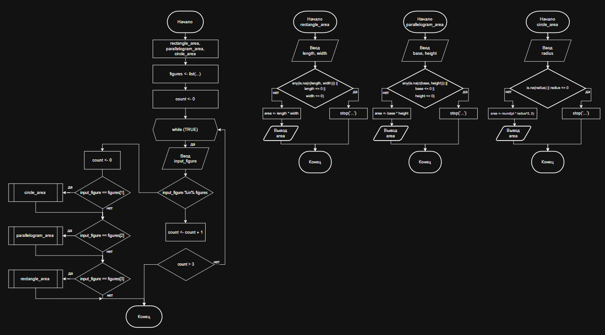
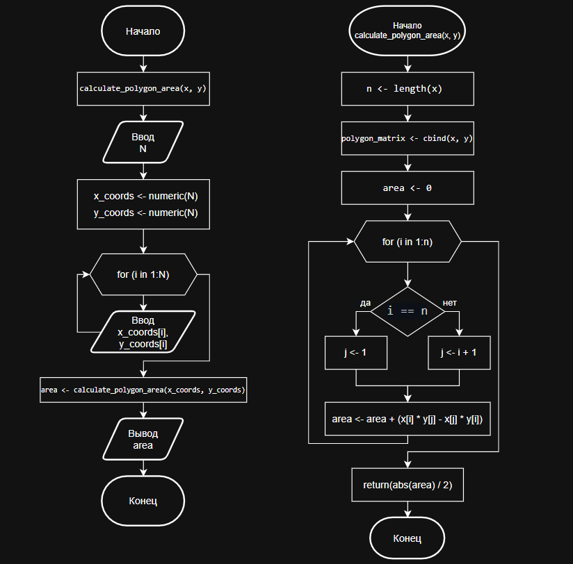

# **Отчет по лабораторной работе 2**
**Тема:** Структурное программирование

## Сведения о студенте
**Дата:** 2025-10-08  
**Семестр:** 2 курс 1 полугодие - 3 семестр  
**Группа:** ПИН-б-о-24-1 (2)  
**Дисциплина:** Технологии программирования  
**Студент:** Макаров Роман Дмитриевич  

---

## **Цель работы**
ознакомиться с особенностями структурного программирования. Решить 
задания в структурном стиле. Составить отчет.  

---

## **Теоретическая часть**
В ходе материала лабораторной работы будут изучены следующие концепции:  

## **Теоретическая часть**
В ходе выполнения лабораторной работы будут изучены следующие концепции:

**Структурное программирование** — методология разработки программ с использованием трех базовых управляющих структур (последовательность, ветвление, цикл) и подпрограмм без оператора goto. Разработка ведется пошагово методом «сверху вниз».

**Теорема Бёма-Якопини** — фундаментальное положение, утверждающее, что любой алгоритм может быть преобразован к структурированному виду с использованием только последовательных структур, ветвлений и циклов.

**Циклы в программировании** — управляющие конструкции для организации многократного выполнения набора инструкций:
- **Бесконечные циклы** — повторение действий без условия выхода
- **Циклы с предусловием (while)** — выполнение при истинности условия, проверяемого до итерации
- **Циклы со счетчиком (for)** — выполнение для каждого значения переменной в заданном диапазоне

**Управление выполнением циклов**:
- **Оператор break** — досрочный выход из цикла
- **Оператор next** — пропуск текущей итерации

**Цель структурного программирования** — повышение производительности разработки, сокращение ошибок, упрощение отладки и сопровождения программного обеспечения за счет четкой организации кода и ограниченного набора управляющих конструкций. 

---

## **Выполненные задания**

### **Задание 1**  
Написать программу, выполненную в структурном стиле. Программа должна рассчитывать площадь фигур (программа должна корректно отрабатывать данные согласно варианту *18* в приложении А). На вход программа запрашивает строку, если в нее введено название фигуры, то программа запрашивает необходимые параметры фигуры, если введено значение отличное от названия фигуры, то программа повторно предлагает ввести название фигуры, если пользователь не справляется с этой задачей более 3 раз подряд, то программа сообщает о некорректности действий пользователя и завершается. В случае введения корректных данных программа должна выдать ответ, а также описание хода решения.  
Программа должна быть выполнена в виде блок-схемы и на ЯВУ.  

---

### **Задание 2**  
Написать программу вычисляющую площадь неправильного многоугольника. Многоугольник на плоскости задается целочисленными координатами своих N вершин в декартовой системе. Стороны многоугольника не соприкасаются (за исключением соседних - в вершинах) и не пересекаются. Программа в первой строке должна принимать число N – количество вершин многоугольника, в последующих N строках – координаты соответствующих вершин (вершины задаются в последовательности против часовой стрелки). На выход программа должна выдавать площадь фигуры.   
Программа должна быть выполнена в виде блок-схемы и на ЯВУ.  

---

## **Ход работы**

### **Задание 1. Вариант 18**

**Блок-схема:**



**Программный код:**
```R
rectangle_area <- function() {
  cat("\tРасчет площади прямоугольника\n")
  length <- as.numeric(readline("Введите длину: "))
  width <- as.numeric(readline("Введите ширину: "))
  
  if (any(is.na(c(length, width))) || length <= 0 || width <= 0) {
    stop("Ошибка: длина и ширина должны быть положительными числами")
  }
  area <- length * width
  cat("Площадь прямоугольника:", area, "\n")
}


parallelogram_area <- function() {
  cat("\tРасчет площади параллелограмма\n")
  base <- as.numeric(readline("Введите основание: "))
  height <- as.numeric(readline("Введите высоту: "))
  
  if (any(is.na(c(base, height))) || base <= 0 || height <= 0) {
    stop("Ошибка: основание и высота должны быть положительными числами")
  }
  
  area <- base * height
  cat("Площадь параллелограмма:", area, "\n")
}


circle_area <- function() {
  cat("\tРасчет площади круга\n")
  radius <- as.numeric(readline("Введите радиус: "))

  if (is.na(radius) || radius <= 0) {
    stop("Ошибка: радиус должен быть положительным числом")
  }
  area <- round(pi * radius^2, 2)
  cat("Площадь круга:", area, "\n")
}


figures <- list('прямоугольник', 'параллелограм', 'круг')
count <- 0
while (TRUE) {
    input_figure <- tolower(readline(prompt = 'Введите название фигуры (прямоугольник, параллелограм, круг): '))
    if (input_figure %in% figures) {
        count <- 0
        if (input_figure == figures[1]) {
            rectangle_area()
        }
        if (input_figure == figures[2]) {
            parallelogram_area()
        }
        if (input_figure == figures[3]) {
            circle_area()
        }
        break
    } else {
        count <- count + 1
        if (count > 3) {
            cat('Вы совершили слишком много попыток! Программа завершена.\n')
            break
        } else {
            cat('Вы ввели неверное название фигуры. Попробуйте еще раз!\n')
        }
    }
}
```

**Пример работы программы:** 
```bash
Введите название фигуры (прямоугольник, параллелограм, круг): abcd
Вы ввели неверное название фигуры. Попробуйте еще раз!
Введите название фигуры (прямоугольник, параллелограм, круг): abcde
Вы ввели неверное название фигуры. Попробуйте еще раз!
Введите название фигуры (прямоугольник, параллелограм, круг): КРУГ
        Расчет площади круга
Введите радиус: 6
Площадь круга: 113.1
```

### **Задание 2.**

**Блок-схема:**



**Программный код:**
```R
calculate_polygon_area <- function(x, y) {
  n <- length(x)
  polygon_matrix <- cbind(x, y)
  
  area <- 0
  for (i in 1:n) {
    j <- ifelse(i == n, 1, i + 1)
    area <- area + (x[i] * y[j] - x[j] * y[i])
  }
  return(abs(area) / 2)
}


main <- function() {
  N <- as.integer(readline(prompt = 'Введите количество вершин многоугольника: '))
  x_coords <- numeric(N)
  y_coords <- numeric(N)

  cat("\tВведите координаты вершин:\n")
  for (i in 1:N) {
    x_coords[i] <- as.numeric(readline(prompt = paste("Вершина ", i, ": x = ", sep = ''))) 
    y_coords[i] <- as.numeric(readline(prompt = paste("Вершина ", i, ": y = ", sep = '')))
  }

  area <- calculate_polygon_area(x_coords, y_coords)
  cat("Площадь многоугольника:", area, "\n")
}
  
main()
```

**Пример работы программы:** 
```bash
Введите количество вершин многоугольника: 3
        Введите координаты вершин:
Вершина 1: x = 0
Вершина 1: y = 0
Вершина 2: x = 2
Вершина 2: y = 3
Вершина 3: x = 1
Вершина 3: y = 3
Площадь многоугольника: 1.5 
```

## **Результаты**

### **Выводы**

1. В ходе выполнения лабораторной работы были успешно освоены принципы структурного программирования через практическую реализацию алгоритмов расчета площадей геометрических фигур. Основное внимание уделялось использованию трех базовых управляющих структур: последовательности, ветвления и циклов, что подтвердило теорему Бёма-Якопини о возможности представления любого алгоритма в структурированном виде.

2. Полученный опыт доказал, что структурное программирование создает надежную основу для разработки сложных программных комплексов, уменьшая вероятность ошибок и упрощая процесс отладки. Приобретенные навыки организации кода без использования оператора goto заложили фундамент для изучения более современных методологий программирования.

---

### **Ответы на контрольные вопросы**

1. **Особенности структурного программирования**  

**Ответ:** Структурное программирование – методология разработки программного обеспечения, в **основе** которой лежит представление программы в виде иерархической структуры блоков. В соответствии с данной методологией любая программа строится без использования оператора goto из трех базовых управляющих структур: последовательность, ветвление, цикл; кроме того, используются подпрограммы. При этом разработка программы ведется пошагово, методом «сверху вниз».

2. **Теорема Бёма – Якопини**  

**Ответ:** **Теорема Бёма – Якопини** – положение структурного программирования согласно которому любой исполняемый алгоритм может быть преобразован к структурированному виду, то есть такому виду, когда ход его выполнения определяется только при помощи трех структур управления: последовательной, ветвлений и повторов или циклов.

3. **Пропуск итерации и досрочный выход из цикла**  

**Ответ:** 
**Пропуск итерации.** Данный оператор применяется, когда в текущей итерации цикла необходимо пропустить все команды до конца тела цикла. При этом сам цикл прерываться не должен, условия продолжения или выхода должны вычисляться обычным образом. В языке C, его языках-потомках и во многих других языках программирования в качестве команды пропуска итерации используется оператор continue в конструкции цикла. Действие этого оператора аналогично безусловному переходу на строку внутри тела цикла, следующую за последней его командой. В языке R специальным оператор для пропуска итерации является next.  
**Досрочный выход из цикла.** Команда досрочного выхода применяется, когда необходимо прервать выполнение цикла, в котором условие выхода еще не достигнуто. Такое бывает, например, когда при выполнении тела цикла обнаруживается ошибка, после которой дальнейшая работа цикла не имеет смысла. Команда досрочного выхода обычно называется break или exit, а ее действие аналогично действию команды безусловного перехода (goto) на команду, непосредственно следующую за циклом, внутри которого эта команда находится.

---

### **Ответы на вопросы для поиска и  письменного ответа**

1. **Цикл с постусловием**  

**Ответ:** *Цикл с постусловием* — это управляющая структура, в которой условие продолжения цикла проверяется после выполнения тела цикла. Это гарантирует, что тело цикла будет выполнено как минимум один раз, даже если условие изначально ложно.

*Особенности:*
- Тело цикла выполняется до проверки условия
- Минимальное количество выполнений тела цикла — 1 раз
- В языке R реализуется с помощью конструкции repeat { ... } if (условие) break

**Пример в R:**
```R
i <- 1
repeat {
  print(i)
  i <- i + 1
  if (i > 5) break  # условие выхода проверяется ПОСЛЕ выполнения тела
}
```
--- 

2. **Совместный цикл**  

**Ответ:** Совместный цикл (foreach loop) — это разновидность цикла, которая автоматически перебирает все элементы коллекции или последовательности без явного управления индексом.

*Особенности:*
- Не требует явного задания счетчика
- Автоматически переходит к следующему элементу
- Исключает ошибки выхода за границы коллекции
- Упрощает чтение и написание кода

**Пример в R:**
```R
cities <- c("Москва", "Париж", "Лондон", "Токио")

# Совместный цикл по элементам вектора
for (city in cities) {
  print(paste("Город:", city))
}

# Совместный цикл по строкам data frame
for (row in 1:nrow(df)) {
  print(df[row, "имя_столбца"])
}
```

---

3. **Вложенные циклы**  

**Ответ:** Вложенные циклы — это структура, при которой один цикл располагается внутри другого. Каждая итерация внешнего цикла вызывает полное выполнение внутреннего цикла.

*Области применения:*
- Обработка многомерных массивов и матриц
- Работа с табличными данными
- Перебор комбинаций значений
- Генерация сложных структур

**Пример в R:**
```R
# Обработка матрицы 3x3
matrix_data <- matrix(1:9, nrow = 3, ncol = 3)

for (i in 1:nrow(matrix_data)) {       # Внешний цикл по строкам
  for (j in 1:ncol(matrix_data)) {     # Внутренний цикл по столбцам
    print(paste("Элемент [", i, ",", j, "] =", matrix_data[i, j]))
  }
}

# Таблица умножения
for (i in 1:5) {
  for (j in 1:5) {
    cat(i * j, "\t")
  }
  cat("\n")
}
```

---

4. **Принцип проектирования программ «сверху-вниз».**  

**Ответ:** Принцип «сверху-вниз» (top-down design) — это методология разработки, при которой сложная задача последовательно разбивается на более простые подзадачи до тех пор, пока они не станут элементарными и легко реализуемыми.
