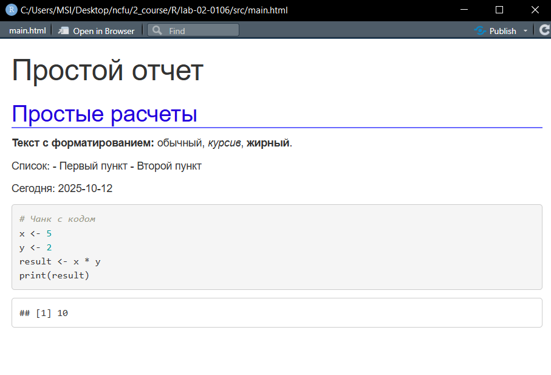

# **Отчет по лабораторной работе 6**
**Тема:** Грамотное программирование 

## Сведения о студенте
**Дата:** 2025-10-12 
**Семестр:** 2 курс 1 полугодие - 3 семестр  
**Группа:** ПИН-б-о-24-1 (2)  
**Дисциплина:** Технологии программирования  
**Студент:** Макаров Роман Дмитриевич  

---

## **Цель работы**
познакомиться с особенностями грамотного программирования. Научиться применять грамотное программирование для создания динамических отчетов с использованием технологии R Markdown. Решить задания в соответствующем стиле программирования. Составить отчет.

---

## **Теоретическая часть**

Для создания динамического документа в *RStudio* необходимо выбрать соответствующий пункт: `New File > R Markdown`. При первом создании файлов R Markdown потребуется установка соответствующего пакета. При создании покажутся соответствующие настройки, которые в дальнейшем можно будет изменить, используя YAML нотацию.

---

## **Выполненные задания**

### **Задание 1**  
Используя технологию *R Markdown* создайте динамический документ с произвольными расчетами. Документ должен содержать вставки кода по типу `inline` и в виде чанков. В документе должно быть использовано различное форматирование. Также для оформления используйте каскадную таблицу стилей. Итоговый документ конвертируйте в *html* формат и представьте в отчете, соответствующие скрины.

---


## **Ход работы**

### **Задание 1.**

**Код файла rmd:**  

````md
---
title: "Простой отчет"
output: 
  html_document:
    css: style.css
---

## Простые расчеты

**Текст с форматированием:** обычный, *курсив*, **жирный**.

Список:
- Первый пункт
- Второй пункт

Сегодня: `r Sys.Date()`

```{r}
# Чанк с кодом
x <- 5
y <- 2
result <- x * y
print(result)
```
````

**Код файла style.css:**  
```css
css
body {
  font-family: Arial;
  background-color: #f0f0f0;
}

h2 {
  color: rgb(34, 0, 223);
  border-bottom: 2px solid rgb(103, 103, 255);
}
```

**Результат (через Knit html):**  


