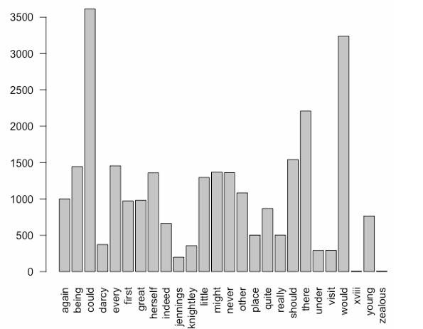
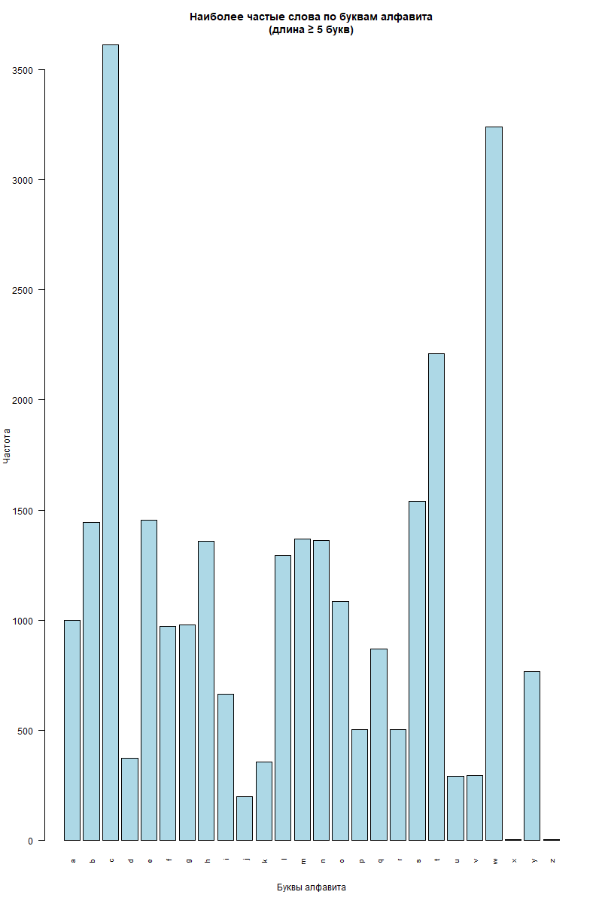

# **Отчет по лабораторной работе 7**
**Тема:** Параллельное программирование 

## Сведения о студенте
**Дата:** 2025-10-12  
**Семестр:** 2 курс 1 полугодие - 3 семестр  
**Группа:** ПИН-б-о-24-1 (2)  
**Дисциплина:** Технологии программирования  
**Студент:** Макаров Роман Дмитриевич  

---

## **Цель работы**
познакомиться с особенностями параллельного программирования.Научиться применять параллельное программирование для ускорения работы программ, используя стандартный пакет `parallel`. Решить задания в соответствующем стиле программирования. Составить отчет. 

---

## **Теоретическая часть**

# Теоретическая часть

## Методы параллельных вычислений в R

В языке программирования R для распараллеливания выполнения кода можно использовать пакет из ядра языка `parallel`, а также другие пакеты, например `foreach` и `future.apply`.

## Методы разделения задач

Существует два основных метода разделения задачи для решения в параллельном стиле:

1. **Разделение на задачи** - каждую из задач можно выполнить независимо друг от друга. В данных задачах используются разные данные.

2. **Разделение по данным** - данный метод встречается часто для обработки больших данных. Примером может быть нахождение суммы элементов ряда: 1 + 2 + 3 + … + 100. Ряд можно разбить на 4 части и посчитать их параллельно: sum(1:25) + sum(26:50) + sum(51:75) + sum(76:100)

## Модели использования памяти

С точки зрения использования памяти существует два принципиальных подхода:

1. **Использование общей памяти** - все процессы имеют доступ к общей области памяти

2. **Использование разделенной памяти** - каждый процесс работает с собственной памятью, обмен данными происходит через механизм передачи сообщений

## Парадигмы параллельного программирования

Существует две основные модели реализации параллельных вычислений:

### Модель Master-Worker (Master-Slave)
- **Master** (главный узел) - распределяет задачи и собирает результаты
- **Worker** (рабочий узел) - выполняет вычисления

### Модель Map-Reduce
- **Map-шаг** - предварительная обработка входных данных, разделение на части
- **Reduce-шаг** - свертка предварительно обработанных данных, формирование конечного результата

## Реализация в пакете parallel

Модель Master-worker наиболее типична для простых параллельных вычислений и реализуется с использованием пакета `parallel`, входящего в состав базового ядра языка R.

Базовый workflow включает:
1. Подключение пакета и определение количества ядер
2. Создание вычислительного кластера
3. Распределение задач по рабочим узлам
4. Сбор результатов
5. Остановка кластера

---

## **Выполненные задания**

### **Задание 1**  
Используя заранее подготовленные функции визуализируйте сведения о наиболее часто встречающихся словах из книг *Джейн Остин* по буквам английского алфавита. Книги, необходимые для анализа, находятся в пакете `janeaustenr`. Также для работы потребуется пакет `stringr`. После установки пакетов добавьте следующие функции: 
```R
extract_words <- function(book_name) { 
text <- subset(austen_books(), book == book_name)$text 
str_extract_all(text, boundary("word")) %>% unlist %>% tolower 
} 
janeausten_words <- function() { 
books <- austen_books()$book %>% unique %>% as.character 
words <- sapply(books, extract_words) %>% unlist 
words 
} 
max_frequency <- function(letter, words, min_length = 1) { 
w <- select_words(letter, words = words, min_length = min_length) 
frequency <- table(w)     
frequency[which.max(frequency)] 
} 
select_words <- function(letter, words, min_length = 1) { 
min_length_words <- words[nchar(words) >= min_length] 
grep(paste0("^", letter), min_length_words, value = TRUE) 
} 
```

Для решения задачи необходимо с помощью функции `janeausten_words()` создать новый объект – вектор слов. Далее, используя одну из функций семейства apply, и заранее созданную функцию `max_frequency` создать именованный вектор, содержащий значение максимально встречающих слов английского алфавита, длиной не менее 5 букв.  
Полезной для работы будет использование встроенной переменной `letters`, содержащей строчные буквы английского алфавита. Для визуализации используйте функцию `barplot()` c аргументом `las = 2`. В случае полностью правильного выполнения задания будет представлен график как на рисунке 6. 



**Рисунок 6** – Решение задания 1 

---


## **Ход работы**

### **Задание 1.**

**Программный код:**
```R
library(janeaustenr)
library(stringr)
library(parallel)

extract_words <- function(book_name) {
  text <- subset(austen_books(), book == book_name)$text
  str_extract_all(text, boundary("word")) %>% unlist %>% tolower
}

janeausten_words <- function() {
  books <- austen_books()$book %>% unique %>% as.character
  words <- sapply(books, extract_words) %>% unlist
  words
}

max_frequency <- function(letter, words, min_length = 1) {
  w <- select_words(letter, words = words, min_length = min_length)
  frequency <- table(w)     
  frequency[which.max(frequency)]
}

select_words <- function(letter, words, min_length = 1) {
  min_length_words <- words[nchar(words) >= min_length]
  grep(paste0("^", letter), min_length_words, value = TRUE)
}

words_vector <- janeausten_words()

# Параллельная обработка с использованием parallel
ncores <- detectCores(logical = FALSE)
cl <- makeCluster(ncores)

# ЭКСПОРТ ВСЕХ НЕОБХОДИМЫХ ФУНКЦИЙ В КЛАСТЕР
clusterExport(cl, c("words_vector", "select_words", "max_frequency"))
clusterEvalQ(cl, {
  library(stringr)
})

# Параллельное вычисление максимальных частот для каждой буквы
max_freq_list <- clusterApply(cl, letters, function(letter) {
  max_frequency(letter, words = words_vector, min_length = 5)
})

# Остановка кластера
stopCluster(cl)

# Преобразование результатов в именованный вектор
max_freq_vector <- unlist(max_freq_list)
names(max_freq_vector) <- letters

# Визуализация результатов
barplot(max_freq_vector, 
        main = "Наиболее частые слова по буквам алфавита\n(длина ≥ 5 букв)",
        xlab = "Буквы алфавита", 
        ylab = "Частота",
        las = 2,
        col = "lightblue",
        cex.names = 0.8)
```

**Полученный вектор:**  

```bash
max_freq_vector
   a    b    c    d    e    f    g    h    i    j    k    l    m    n    o    p 
1001 1445 3613  373 1456  972  981 1360  664  199  356 1295 1369 1362 1084  503 
   q    r    s    t    u    v    w    x    y    z
 870  504 1541 2209  293  294 3238    4  766    5
```

**График через barplot():**  



---

### **Задание 2.**

**Программный код:**  

```R
library(parallel)

mean_of_rnorm <- function(n) {
  random_numbers <- rnorm(n)
  mean(random_numbers)
}

ncores <- detectCores(logical = FALSE)
cl <- makeCluster(ncores)

result <- parLapply(cl, rep(10000, 50), mean_of_rnorm)
result <- unlist(result)

stopCluster(cl)

print(head(result))
print(paste("Среднее значение результатов:", mean(result)))
```

**Результат работы программы:**  

```bash
[1]  0.0024587272 -0.0009558854  0.0176208865  0.0162186812  0.0024492586
[6] -0.0083567495
[1] "Среднее значение результатов: -0.0015126886734399"
```