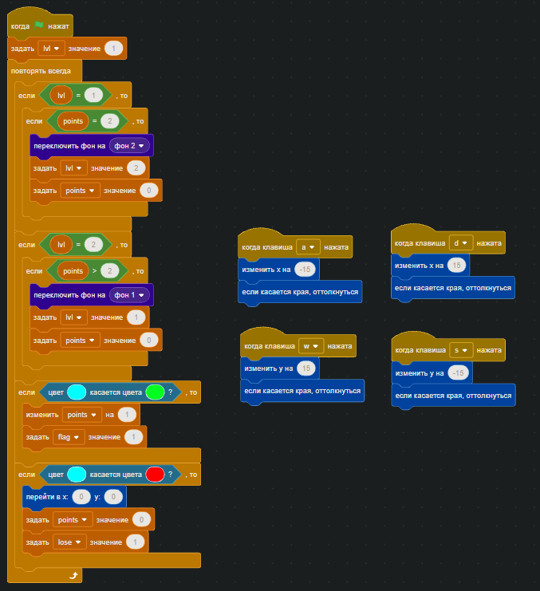
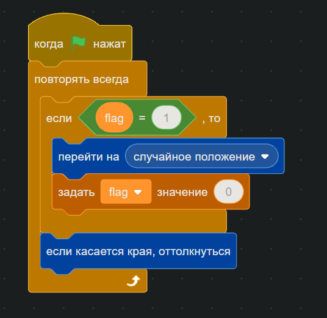
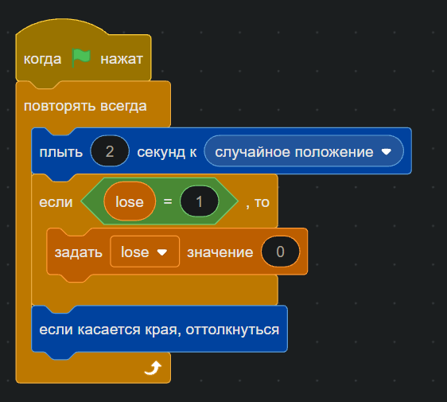
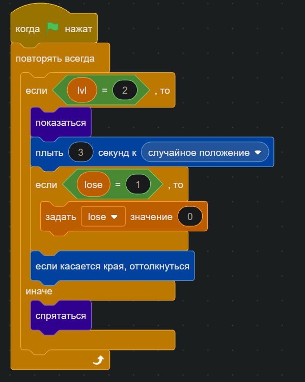
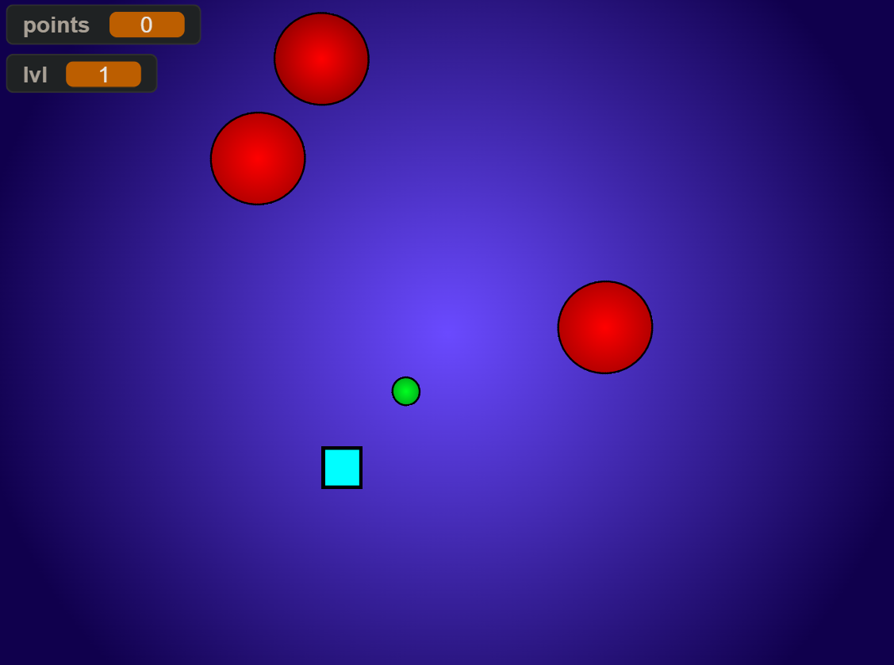
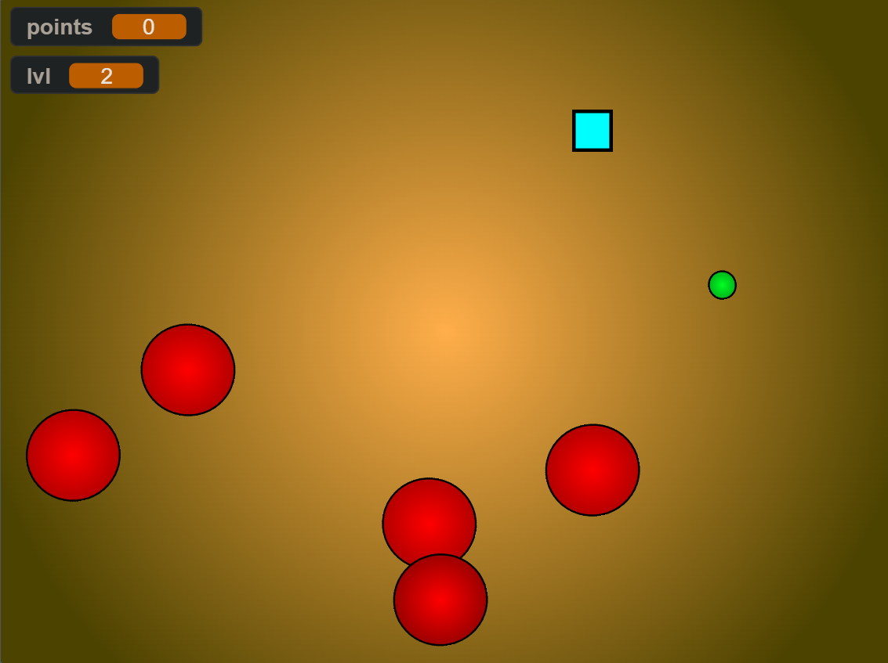

# **Отчет по лабораторной работе 8**
**Тема:** Визуальное программирование 

## Сведения о студенте
**Дата:** 2025-10-13  
**Семестр:** 2 курс 1 полугодие - 3 семестр  
**Группа:** ПИН-б-о-24-1 (2)  
**Дисциплина:** Технологии программирования  
**Студент:** Макаров Роман Дмитриевич  

---

## **Цель работы**
познакомиться с особенностями визуального программирования. Научиться строить программы в визуальном стиле, с использованием языка Scratch. Составить отчет. 

---

## **Выполненные задания**

### **Задание 1**  
Создайте игру на произвольную тему. В игре должно быть не менее 3 активных спрайтов с прописанной логикой.  
Спрайт 1 – активный персонаж, управляемый пользователем.  
Спрайт 2 – персонаж, выполняющий действия вне зависимости от поведения пользователя.  
Спрайт 3 – персонаж (объект), меняющий поведение в зависимости от действий пользователя.  
В игре должна быть система уровней (минимум 2), реализованная через смену фонов.

---

## **Ход работы**

### **Задание 1.**

**Кратко об игре:** основной управляемый персонаж - голубой квадрат, его цель собрать необходимое количество очков (*зеленый круг - поинт, очко*) (2 очка) чтобы перейти на следующий уровень (уровнь 2), при достижении следующего уровня количество необходимых для сбора очков увеличивается (3 очка). Красный круг - независимые персонажи, которые мешают собрать очки, ведь при столкновении с ними количество очков сбрасывается до 0.

---

**Спрайт 1.** Голубой квадрат - активный персонаж, управляемый пользователем.  

**Алгоритм для 1 спрайта:**  

---

**Спрайт 2.** Зеленый круг - персонаж (объект), меняющий поведение в зависимости от действий пользователя. При столкновении с *спрайтом 1*, меняет свое положение на случайное и увеличивает количество очков (переменная - `points`) на 1.

**Алгоритм для 2 спрайта:**  

---

**Спрайты 3-7.** Красный круг - персонаж, выполняющий действия вне зависимости от поведения пользователя. Движется в случайном направлении в течение 2 секунд, при столкновении с *спрайтом 1*, последний переносится в начальное положение (`x=0; y=0`), а количество очков `points` принимает значение 0. При смене фона на *фон 1*, активны только *спрайты 3-5* (*спрайты 6 и 7* спрятаны), при смене на *фон 2* *спрайты 6 и 7* становятся активны, 

**Алгоритм для 3-5 спрайтов:**  

**Алгоритм для 6-7 спрайтов:**  

---

**Уровень 1:**  

**Уровень 2:**  

